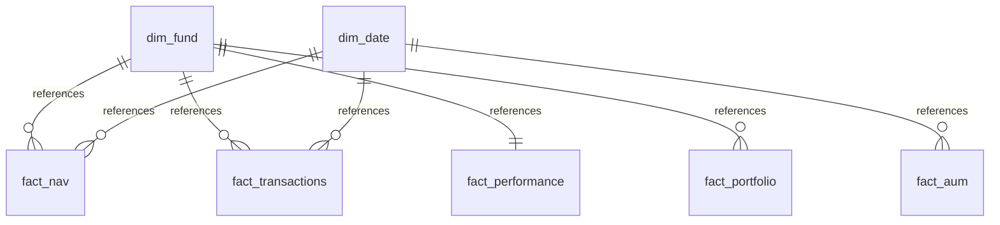

# Database Schema Documentation - Mutual Fund Analytics Star Schema

This document details the architecture, tables, constraints, indexing strategies, and database load mechanics implemented for the Mutual Fund Analytics Platform.

---

## 1. Database Overview

The relational model implements a **Star Schema** designed to support fast aggregation, slicing, and financial risk computations for mutual funds.

* **Database Engine:** SQLite (local development) / PostgreSQL (production-ready via SQLAlchemy engine bindings)
* **File Location (Local):** `mutual_fund_analytics.db`
* **Schema Design Pattern:** Star Schema

---

## 2. Table Definitions & Relationships

### Dimensions

#### 1. `dim_fund`
* **Purpose:** Core scheme characteristics master dimension.
* **Columns:**
  * `amfi_code` (INTEGER, Primary Key): Unique AMFI code.
  * `fund_house` (VARCHAR): Asset Management Company name.
  * `scheme_name` (VARCHAR): Full name of the fund.
  * `category` / `sub_category` (VARCHAR): SEBI asset segments.
  * `plan` (VARCHAR): `Regular` or `Direct`.
  * `launch_date` (DATE)
  * `benchmark` (VARCHAR)
  * `expense_ratio_pct` (FLOAT)
  * `exit_load_pct` (FLOAT)
  * `min_sip_amount` / `min_lumpsum_amount` (FLOAT)
  * `fund_manager` (VARCHAR)
  * `risk_category` (VARCHAR)
  * `sebi_category_code` (VARCHAR)

#### 2. `dim_date`
* **Purpose:** Calendar lookup table. Allows slicing by year, month, quarter, and weekdays.
* **Columns:**
  * `date_id` (DATE, Primary Key): `YYYY-MM-DD` ISO date.
  * `year` (INTEGER)
  * `month` (INTEGER)
  * `quarter` (INTEGER)
  * `is_weekday` (BOOLEAN): Flag for business days.

---

### Facts

#### 1. `fact_nav`
* **Purpose:** Daily Net Asset Value (NAV) price facts.
* **Composite Primary Key:** (`amfi_code`, `date_id`)
* **Foreign Keys:**
  * `amfi_code` references `dim_fund(amfi_code)`
  * `date_id` references `dim_date(date_id)`
* **Special Handling:** Weekend/holiday gaps are forward-filled (`ffill`) during cleaning.

#### 2. `fact_transactions`
* **Purpose:** Individual investor transaction orders.
* **Primary Key:** `tx_id` (Generated e.g., `TX000001`)
* **Foreign Keys:**
  * `amfi_code` references `dim_fund(amfi_code)`
  * `transaction_date` references `dim_date(date_id)`
* **CHECK Constraints:**
  * `transaction_type IN ('Sip', 'Lumpsum', 'Redemption')`
  * `kyc_status IN ('Verified', 'Pending')`

#### 3. `fact_performance`
* **Purpose:** Aggregated risk and return performance indicators.
* **Primary Key / Foreign Key:** `amfi_code` references `dim_fund(amfi_code)`
* **CHECK Constraints:**
  * `morningstar_rating >= 1 AND morningstar_rating <= 5`

#### 4. `fact_portfolio`
* **Purpose:** Stock holdings weights per scheme.
* **Composite Primary Key:** (`amfi_code`, `stock_symbol`, `portfolio_date`)
* **Foreign Keys:**
  * `amfi_code` references `dim_fund(amfi_code)`
  * `portfolio_date` references `dim_date(date_id)`

#### 5. `fact_aum`
* **Purpose:** Quarterly AMC Assets Under Management assets scale.
* **Composite Primary Key:** (`fund_house`, `date_id`)
* **Foreign Keys:**
  * `date_id` references `dim_date(date_id)`

#### 6. `fact_sip_industry`
* **Purpose:** Monthly macro-level industry SIP inflow statistics.
* **Primary Key:** `month` (`YYYY-MM`)

---

## 3. SQL Optimization (Indexing)

To guarantee sub-second dashboard performance, index parameters are mapped to key queries:

1. **NAV Chronology Index:**
   `idx_fact_nav_composite` on `fact_nav(amfi_code, date_id)`. Optimize time-series lookups, standard deviations, and returns.
2. **Transaction Demographics Index:**
   `idx_fact_transactions_amfi` on `fact_transactions(amfi_code)` and `idx_fact_transactions_date` on `fact_transactions(transaction_date)`. Optimizes query filters for cohorts and locations.
3. **Holding Concentration Index:**
   `idx_fact_portfolio_composite` on `fact_portfolio(amfi_code, portfolio_date)`. Optimizes sector HHI concentration calculations.
