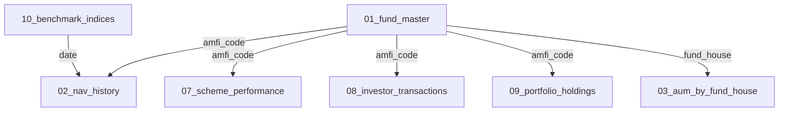
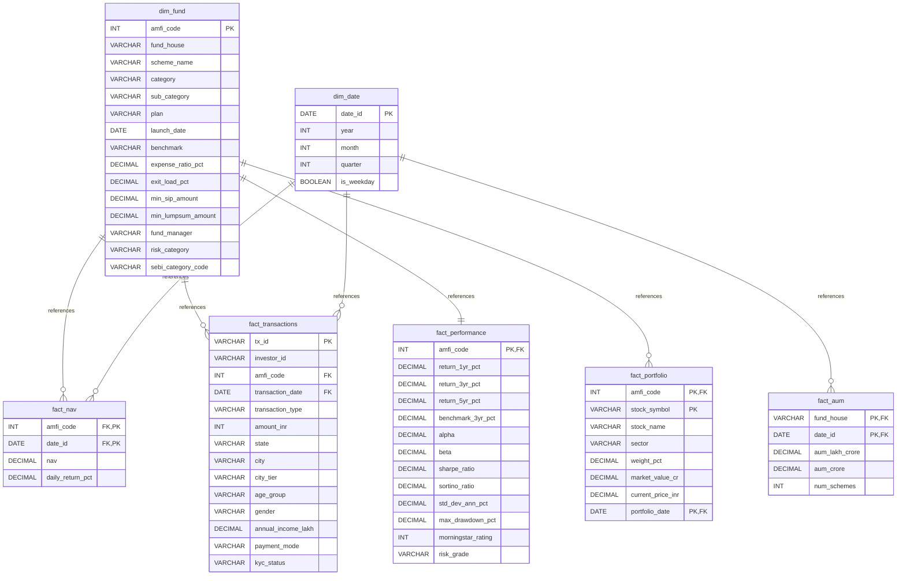

# Entity Relationship Diagram & Join Strategy - Mutual Fund Analytics

This document defines the relational database model (ERD), relationships, indexing rules, and join strategy designed for the Mutual Fund Analytics Platform.

---

## 1. Dataset Relationship Diagram

This diagram shows how the pre-packaged raw datasets map to each other at a business concept level:



---

## 2. Entity Relationship Diagram (ERD)

The structured star schema is represented below. It translates raw files into standard normalized dimensions (`dim_`) and transaction/price facts (`fact_`):



---

## 3. Recommended SQL Join Strategy

1. **NAV and Benchmark Joins (For Alpha/Beta & Tracking Error):**
   * Join `fact_nav` and `fact_nav` of the benchmark index (via `10_benchmark_indices`) on the `date` key. Use an `INNER JOIN` to align active trading dates.
   * *SQL Pattern:*
     ```sql
     SELECT n.date, n.amfi_code, n.nav, b.close_value AS benchmark_close
     FROM fact_nav n
     INNER JOIN fact_benchmark b ON n.date_id = b.date_id AND b.index_name = n.benchmark_name;
     ```

2. **Investor Transactions to Fund Metadata (For Demographic segmentation):**
   * Join `fact_transactions` to `dim_fund` using an `INNER JOIN` on `amfi_code` to enrich investor cohorts with fund risk categories, fund houses, and expense ratios.
   * *SQL Pattern:*
     ```sql
     SELECT t.*, f.risk_category, f.fund_house
     FROM fact_transactions t
     INNER JOIN dim_fund f ON t.amfi_code = f.amfi_code;
     ```

3. **Portfolio Concentration Join (HHI computation):**
   * Join `fact_portfolio` with `dim_fund` on `amfi_code` to filter equity holdings by category (e.g. Large vs Mid Cap) and group weight distributions.
   * *SQL Pattern:*
     ```sql
     SELECT p.amfi_code, f.scheme_name, p.sector, sum(p.weight_pct) as sector_weight
     FROM fact_portfolio p
     INNER JOIN dim_fund f ON p.amfi_code = f.amfi_code
     GROUP BY p.amfi_code, f.scheme_name, p.sector;
     ```

---

## 4. Indexing Recommendations

To support sub-second query performance for the analytics dashboard, implement the following indexes:

1. **`idx_fact_nav_composite`:** Create a composite index on `fact_nav(amfi_code, date_id)`. Since historical NAV is queried chronologically per scheme, this index enables high-performance ranges and CAGR lookups.
2. **`idx_fact_transactions_amfi`:** Index `fact_transactions(amfi_code)` and `fact_transactions(transaction_date)` to speed up aggregation runs for transaction timelines.
3. **`idx_fact_portfolio_composite`:** Composite index on `fact_portfolio(amfi_code, portfolio_date)` for portfolio snapshot retrievals.
4. **`idx_fact_benchmark_index`:** Composite index on `fact_benchmark(index_name, date_id)` to speed up benchmark regressions.
