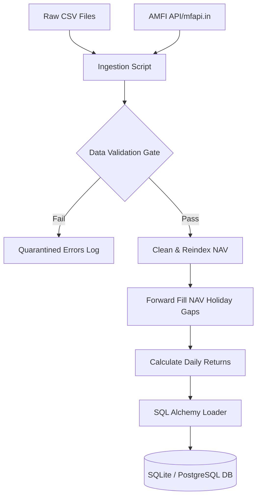
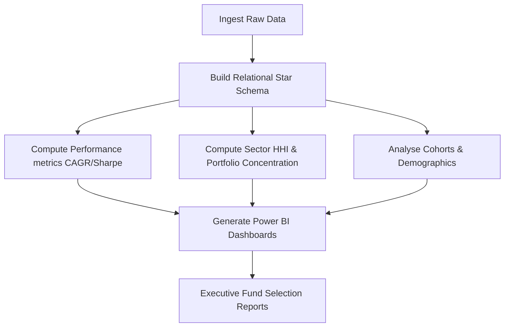
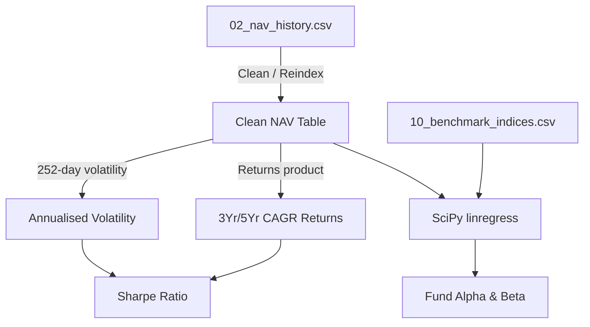

# ETL Pipeline Design & Data Analytics Architecture

This document describes the design of the ETL pipelines, business workflows, data lineage, data quality controls, feature engineering opportunities, and target KPIs for the Mutual Fund Analytics Platform.

---

## 1. ETL Flow Diagram

The ETL pipeline follows the standard **Extract -> Transform -> Load** sequence to process raw files and fetch updates:

---

## 2. Business Workflow Diagram

This diagram displays the business operations and analytics reporting flow:

---

## 3. Data Lineage

This chart traces data lineage from sources to derived metrics:

---

## 4. Potential Data Quality Problems & Solutions

1. **Date Gaps (Weekends & Public Holidays):**
   * *Problem:* Stock and mutual fund values do not update on weekends, resulting in date gaps in NAV tables.
   * *Solution:* Implement forward-fill (`ffill()`) after reindexing to a continuous daily date calendar.
2. **Conflicting AMC/Category Naming Conventions:**
   * *Problem:* Minor variations in AMC or scheme naming across datasets (e.g., `SBI Mutual Fund` vs `SBI MF`).
   * *Solution:* Joins must be strictly performed using `amfi_code` (unique numeric key) rather than text strings.
3. **KYC Status Integrity:**
   * *Problem:* Missing or 'Pending' KYC transactions skewing real transaction distributions.
   * *Solution:* Flag pending transactions in the analytics layer to isolate verified performance reports.

---

## 5. Feature Engineering Opportunities

1. **Rolling Historical Volatility:** Calculate rolling 30, 90, and 365-day returns standard deviations to measure structural volatility shifts.
2. **SIP Recurrence Gap:** Difference between consecutive transaction dates for a single investor to track payment delay trends.
3. **Relative Portfolio Weights:** Difference between stock holding weights and corresponding benchmark weight allocations to evaluate active management tracking.

---

## 6. Target KPIs to Derive

1. **Compound Annual Growth Rate (CAGR):**
   $$\text{CAGR} = \left(\frac{\text{NAV}_{\text{end}}}{\text{NAV}_{\text{start}}}\right)^{\frac{252}{n_{\text{trading\_days}}}} - 1$$
2. **Sharpe Ratio:**
   $$\text{Sharpe} = \frac{\text{Annualised Return} - R_f}{\text{Annualised Std Dev}}$$
3. **Sortino Ratio:**
   $$\text{Sortino} = \frac{\text{Annualised Return} - R_f}{\text{Annualised Downside Deviation}}$$
4. **Herfindahl-Hirschman Index (HHI) for Sector Concentration:**
   $$\text{HHI} = \sum_{i=1}^{N} (w_i)^2$$
   *(Where $w_i$ is the weight of sector $i$ in the fund's portfolio. High HHI signifies high concentration risk).*
5. **Investor Cohort Retention Rate:** Period-over-period active investors per cohort.
