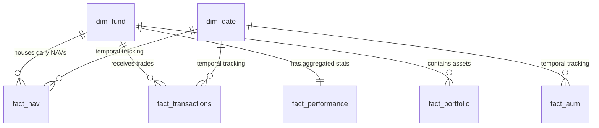

# Mutual Fund Analytics - Repository Audit & Architecture Report

This report presents a thorough inspection, inventory, and architectural design of the Mutual Fund Analytics repository, acting as the foundation before any ETL or analytics implementation begins.

---

## 1. Repository Inventory

The repository is organized into the target production-grade layout. The files currently present are:

| File / Folder Path | Type | Size / Rows | Purpose |
| :--- | :--- | :--- | :--- |
| `docs/Bluestock_MF_Capstone_Project.pdf` | PDF | 56 KB | Project Source of Truth, Requirements, and Evaluation Criteria |
| `data/raw/01_fund_master.csv` | CSV | 40 rows | Mutual Fund Schemes master list |
| `data/raw/02_nav_history.csv` | CSV | 46,000 rows | Daily Net Asset Values (NAV) for all 40 schemes (Jan 2022 - May 2026) |
| `data/raw/03_aum_by_fund_house.csv` | CSV | 90 rows | Quarterly Assets Under Management (AUM) by AMC (2022 - 2025) |
| `data/raw/04_monthly_sip_inflows.csv` | CSV | 48 rows | Monthly mutual fund industry SIP inflows |
| `data/raw/05_category_inflows.csv` | CSV | 144 rows | Inflow by category (Large, Mid, Small, ELSS, etc.) for FY 2024-25 |
| `data/raw/06_industry_folio_count.csv` | CSV | 21 rows | Folio count milestones split by Equity, Debt, and Hybrid |
| `data/raw/07_scheme_performance.csv` | CSV | 40 rows | Computed performance, return, and risk metrics per scheme |
| `data/raw/08_investor_transactions.csv` | CSV | ~32,778 rows | Simulated investor transactions (SIP, Lumpsum, Redemptions) |
| `data/raw/09_portfolio_holdings.csv` | CSV | ~320 rows | Equity holdings weights and sectors for funds as of Dec 2025 |
| `data/raw/10_benchmark_indices.csv` | CSV | ~8,050 rows | Daily benchmark index close values (Nifty 50, Nifty 100, etc.) |
| `requirements.txt` | Configuration | 262 Bytes | Declared project dependencies |
| `.gitignore` | Configuration | 2.0 KB | Version control exclusion rules |
| `LICENSE` | Text | 1.0 KB | Project MIT License |
| `README.md` | Markdown | 3.2 KB | Project documentation |

---

## 2. Dataset Inventory

For each of the 10 raw CSV files, we have extracted shape, columns, keys, and expected business purposes:

### 01_fund_master.csv
* **Shape:** 40 rows × 15 columns
* **Columns:** `amfi_code`, `fund_house`, `scheme_name`, `category`, `sub_category`, `plan`, `launch_date`, `benchmark`, `expense_ratio_pct`, `exit_load_pct`, `min_sip_amount`, `min_lumpsum_amount`, `fund_manager`, `risk_category`, `sebi_category_code`
* **Primary Key:** `amfi_code` (Unique AMFI Code)
* **Foreign Keys:** None
* **Relationships:** Parents to `02_nav_history.csv`, `07_scheme_performance.csv`, `08_investor_transactions.csv`, and `09_portfolio_holdings.csv` on `amfi_code`. Matches `03_aum_by_fund_house.csv` via `fund_house`.
* **Business Purpose:** Central dimension for scheme metadata.

### 02_nav_history.csv
* **Shape:** 46,000 rows × 3 columns
* **Columns:** `amfi_code`, `date`, `nav`
* **Primary Key:** Composite Key (`amfi_code`, `date`)
* **Foreign Keys:** `amfi_code` (references `01_fund_master.amfi_code`)
* **Relationships:** Joined on `amfi_code` with `01_fund_master.csv` and `date` with `10_benchmark_indices.csv` or calendar dimensions.
* **Business Purpose:** Base time-series data to calculate daily/cumulative/annualized returns, standard deviation, drawdowns, and rolling Sharpe/Sortino ratios.

### 03_aum_by_fund_house.csv
* **Shape:** 90 rows × 5 columns
* **Columns:** `date`, `fund_house`, `aum_lakh_crore`, `aum_crore`, `num_schemes`
* **Primary Key:** Composite Key (`date`, `fund_house`)
* **Foreign Keys:** `fund_house` (maps to `01_fund_master.fund_house` implicitly)
* **Business Purpose:** Monitored growth trends of the 10 largest fund houses over 4+ years.

### 04_monthly_sip_inflows.csv
* **Shape:** 48 rows × 6 columns
* **Columns:** `month`, `sip_inflow_crore`, `active_sip_accounts_crore`, `new_sip_accounts_lakh`, `sip_aum_lakh_crore`, `yoy_growth_pct`
* **Primary Key:** `month` (YYYY-MM)
* **Foreign Keys:** None
* **Business Purpose:** Industry-level macro trend analysis of SIP adoption.

### 05_category_inflows.csv
* **Shape:** 144 rows × 3 columns
* **Columns:** `month`, `category`, `net_inflow_crore`
* **Primary Key:** Composite Key (`month`, `category`)
* **Foreign Keys:** `category` (joins with `01_fund_master.category`)
* **Business Purpose:** Industry flows showing which categories (Large Cap, Mid Cap, Small Cap, Hybrid) attract the most capital dynamically.

### 06_industry_folio_count.csv
* **Shape:** 21 rows × 6 columns
* **Columns:** `month`, `total_folios_crore`, `equity_folios_crore`, `debt_folios_crore`, `hybrid_folios_crore`, `others_folios_crore`
* **Primary Key:** `month` (YYYY-MM)
* **Business Purpose:** Tracking total mutual fund industry growth and retail participation segments.

### 07_scheme_performance.csv
* **Shape:** 40 rows × 19 columns
* **Columns:** `amfi_code`, `scheme_name`, `fund_house`, `category`, `plan`, `return_1yr_pct`, `return_3yr_pct`, `return_5yr_pct`, `benchmark_3yr_pct`, `alpha`, `beta`, `sharpe_ratio`, `sortino_ratio`, `std_dev_ann_pct`, `max_drawdown_pct`, `aum_crore`, `expense_ratio_pct`, `morningstar_rating`, `risk_grade`
* **Primary Key:** `amfi_code`
* **Foreign Keys:** `amfi_code` (references `01_fund_master.amfi_code`)
* **Business Purpose:** Calculated reference table for performance and risk ratios. Used to build fund scorecards (composite score 0-100) and compare returns.

### 08_investor_transactions.csv
* **Shape:** 32,778 rows × 13 columns
* **Columns:** `investor_id`, `transaction_date`, `amfi_code`, `transaction_type`, `amount_inr`, `state`, `city`, `city_tier`, `age_group`, `gender`, `annual_income_lakh`, `payment_mode`, `kyc_status`
* **Primary Key:** Generated transaction ID (`tx_id`)
* **Foreign Keys:** `amfi_code` (references `01_fund_master.amfi_code`)
* **Business Purpose:** Core fact table representing individual transaction behavior. Demographics (age, gender, income) and geography (state, city) analysis.

### 09_portfolio_holdings.csv
* **Shape:** 323 rows × 8 columns
* **Columns:** `amfi_code`, `stock_symbol`, `stock_name`, `sector`, `weight_pct`, `market_value_cr`, `current_price_inr`, `portfolio_date`
* **Primary Key:** Composite Key (`amfi_code`, `stock_symbol`, `portfolio_date`)
* **Foreign Keys:** `amfi_code` (references `01_fund_master.amfi_code`)
* **Business Purpose:** Underlying assets analysis. Used for computing the Herfindahl-Hirschman Index (HHI) for sector concentration risk.

### 10_benchmark_indices.csv
* **Shape:** 8,051 rows × 3 columns
* **Columns:** `date`, `index_name`, `close_value`
* **Primary Key:** Composite Key (`date`, `index_name`)
* **Business Purpose:** Tracks historical benchmarks (Nifty 50, Nifty 100, BSE SmallCap) to compute rolling alpha, beta, and tracking error.

---

## 3. PDF Summary (Source of Truth)

* **Project Objective:** Build a full-stack Mutual Fund Analytics Platform, implementing an ETL pipeline, normalizing data in a 5+ table relational star schema (SQLite/PostgreSQL), performing exploratory data analysis, and creating an interactive dashboard.
* **Deliverables:**
  1. ETL Pipeline Script (`.py` code).
  2. SQL Database file / SQLite (`.db`).
  3. Jupyter Notebooks for EDA (15+ charts).
  4. Performance Metrics (CAGR, Sharpe, Sortino, Alpha/Beta regressions).
  5. Interactive Dashboard (Power BI / Tableau or Streamlit).
  6. Advanced Analytics (Historical VaR, HHI index, Cohort & continuation analysis).
  7. Final PDF Report (15-20 pages) & Presentation Slides (12 slides).
* **Constraints / Rules to Follow:**
  * **Risk-free proxy rate (Rf):** 6.5% (RBI Repo Rate proxy).
  * **Annualization Factor:** Standardize using 252 trading days (use `sqrt(252)` for standard deviation).
  * CAGR calculations must use actual trading days or `(252/n_days)` annualization instead of calendar days.
  * Weekend/Holiday handling: Reindex to full date range and **forward-fill (`ffill`)** missing NAVs.
  * AUM units: Avoid confusing fund-house level AUM (Rs. Lakh Crore) with scheme-level AUM (Rs. Crore). Include units in column headers.
  * **Security Constraint:** Never upload database files (`.db` / `.sqlite`) greater than 100MB to GitHub. Update `.gitignore` to ignore `.db` and upload `schema.sql` and restore scripts instead.

---

## 4. Data Dictionary

The following table structure defines the physical database model schema to load after ETL processing:

```sql
-- 1. dim_fund (Dimension)
CREATE TABLE dim_fund (
    amfi_code INT PRIMARY KEY,
    fund_house TEXT NOT NULL,
    scheme_name TEXT NOT NULL,
    category TEXT NOT NULL,
    sub_category TEXT NOT NULL,
    plan TEXT NOT NULL,
    launch_date DATE,
    benchmark TEXT,
    expense_ratio_pct REAL,
    exit_load_pct REAL,
    min_sip_amount REAL,
    min_lumpsum_amount REAL,
    fund_manager TEXT,
    risk_category TEXT,
    sebi_category_code TEXT
);

-- 2. dim_date (Dimension)
CREATE TABLE dim_date (
    date_id DATE PRIMARY KEY,
    year INT NOT NULL,
    month INT NOT NULL,
    quarter INT NOT NULL,
    is_weekday BOOLEAN NOT NULL
);

-- 3. fact_nav (Fact)
CREATE TABLE fact_nav (
    amfi_code INT REFERENCES dim_fund(amfi_code),
    date_id DATE REFERENCES dim_date(date_id),
    nav REAL NOT NULL,
    daily_return_pct REAL,
    PRIMARY KEY (amfi_code, date_id)
);

-- 4. fact_transactions (Fact)
CREATE TABLE fact_transactions (
    tx_id TEXT PRIMARY KEY,
    investor_id TEXT NOT NULL,
    amfi_code INT REFERENCES dim_fund(amfi_code),
    transaction_date DATE REFERENCES dim_date(date_id),
    transaction_type TEXT CHECK(transaction_type IN ('SIP', 'Lumpsum', 'Redemption')),
    amount_inr INT NOT NULL,
    state TEXT,
    city TEXT,
    city_tier TEXT CHECK(city_tier IN ('T30', 'B30')),
    age_group TEXT,
    gender TEXT,
    annual_income_lakh REAL,
    payment_mode TEXT,
    kyc_status TEXT CHECK(kyc_status IN ('Verified', 'Pending'))
);

-- 5. fact_performance (Fact)
CREATE TABLE fact_performance (
    amfi_code INT PRIMARY KEY REFERENCES dim_fund(amfi_code),
    return_1yr_pct REAL,
    return_3yr_pct REAL,
    return_5yr_pct REAL,
    benchmark_3yr_pct REAL,
    alpha REAL,
    beta REAL,
    sharpe_ratio REAL,
    sortino_ratio REAL,
    std_dev_ann_pct REAL,
    max_drawdown_pct REAL,
    morningstar_rating INT,
    risk_grade TEXT
);

-- 6. fact_portfolio (Fact)
CREATE TABLE fact_portfolio (
    amfi_code INT REFERENCES dim_fund(amfi_code),
    stock_symbol TEXT NOT NULL,
    stock_name TEXT NOT NULL,
    sector TEXT NOT NULL,
    weight_pct REAL NOT NULL,
    market_value_cr REAL,
    current_price_inr REAL,
    portfolio_date DATE NOT NULL,
    PRIMARY KEY (amfi_code, stock_symbol, portfolio_date)
);

-- 7. fact_aum (Fact)
CREATE TABLE fact_aum (
    fund_house TEXT NOT NULL,
    date_id DATE REFERENCES dim_date(date_id),
    aum_lakh_crore REAL,
    aum_crore REAL,
    num_schemes INT,
    PRIMARY KEY (fund_house, date_id)
);

-- 8. fact_sip_industry (Fact)
CREATE TABLE fact_sip_industry (
    month TEXT PRIMARY KEY, -- YYYY-MM
    sip_inflow_crore REAL,
    active_sip_accounts_crore REAL,
    new_sip_accounts_lakh REAL,
    sip_aum_lakh_crore REAL,
    yoy_growth_pct REAL
);
```

---

## 5. Dataset Relationship Diagram



---

## 6. Repository Improvement Suggestions

1. **SQL Schema Verification:** Ensure database indices are explicitly created on `amfi_code` and `date_id` fields to guarantee high performance when querying sub-second responses for analytics.
2. **Pipenv/Poetry:** Upgrade dependency management to Poetry or a strict `requirements.txt` with locked hashes (`requirements-lock.txt`) for consistent dependency environments in production.
3. **Pylint & Pre-Commit:** Introduce a `.pre-commit-config.yaml` to run auto-formatters (e.g., `black`, `isort`, `flake8`) before developer commits to maintain code styling hygiene.

---

## 7. Recommended Development Roadmap

| Day | Task Group | Action Items |
| :--- | :--- | :--- |
| **Day 1** | Ingestion & Environment Setup | Environment config, API integration fetcher (`mfapi.in`), validation logic. |
| **Day 2** | Data Cleaning & DB Loader | Python cleaning pipelines (handle nulls, forward-fill NAVs), SQLite schema compilation. |
| **Day 3** | Exploratory Data Analysis | Jupyter notebooks, generate 15+ required visualizations. |
| **Day 4** | Fund Performance Analytics | CAGR, Sharpe, Sortino, Alpha, Beta, Max Drawdowns computations. |
| **Day 5** | Dashboard Development | Power BI / Tableau connection or Streamlit layout design. |
| **Day 6** | Advanced Risk Metrics | Historical VaR, CVaR, HHI, and Cohort analyses. |
| **Day 7** | Review & Final Deliverables | Code refactoring, generating PDF report, preparing slides. |

---

## 8. Risk Assessment

* **Data Consistency:** Raw `01_fund_master.csv` scheme names might slightly mismatch `02_nav_history.csv` names. AMFI codes must be used as the single source of truth for joins.
* **Holiday Gaps in NAV:** Weekend/holiday gaps will bias standard deviation downwards if not forward-filled (`ffill`) properly.
* **Outliers / Bad Data:** Check for negative NAVs, zero or negative transaction amounts (`amount_inr <= 0`), and incorrect KYC values.
* **Large Files on Git:** Database file output might grow over time. We must ensure `*.db` is explicitly ignored in `.gitignore`.

---

## 9. Key Questions for Clarification

1. **Database engine choice:** SQLite is recommended in the PDF for local development. Should we design the code to be engine-agnostic (using SQLAlchemy) so it can switch to PostgreSQL via a configuration parameter?
2. **Live API usage:** Should the daily pipeline pull from the live AMFI / `mfapi.in` API to append new records, or only run on the static CSV datasets?
3. **Transaction KYC Validation:** For transaction records with missing/pending KYC, should we drop, flag, or include them in final behavioral statistics?
